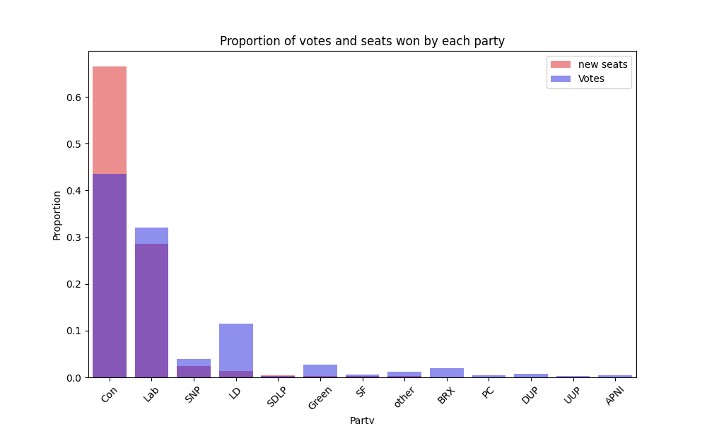
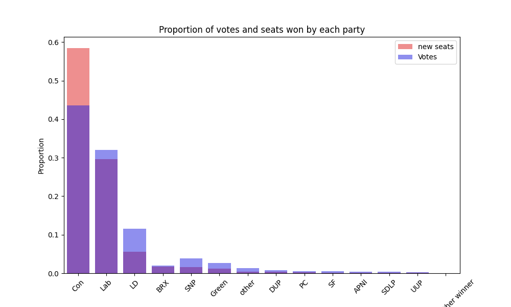

# A Form of PR in the UK

I do not know much about politics, what i do know is that many people do not think that the current votising system that the uk usees represents the wants of the country fairly. in the past, some partys have gained a good share of the votes however not recieved many seats in parliment. This is because the UK uses a system called first past the post. This means that the party with the most votes in a consituency wins the seat.

What i am proposing is a form of proportioal representation. I am approching this problem niively at the begining as to not scew my "general public fairness" view. I will then compare what i have come up with to other systems of PR to see if it is better or worse.

the main requirements for this system are:
- it must appear fair
- it must be simple to understand
- it must be simple to implement
- the party with the most votes should have the most seats
- there should be a case where a coalition is needed to form a government
- smaller partys should be able to gain seats if they have a good share of the votes
- constituatncies should still be fairly represented

proposed process for the new system:
1. automatic seat gain at 50% of the vote in a constituency
2. calculate total vote share for each party
3. calculate the number of seats each party should have based on the total vote share
4. allocate the remaining seats to the party with the highest vote share in each constituency

## The Current System

The current system in the UK is called first past the post. This means that the party with the most votes in a consituency wins the seat. This system is simple to understand and implement. 

However, this system mens that the some parties may not get the representation called for by the public. An example of this is when a party wins by a very small proportion in a constituency. the second most voted for, their votes are then 'lost' but still represent a large portion of the population.

In the 2019 election this is the vote share in comparisiton to the seats won by each party:

This graph shows that conservatives gained more seats than the vote share would suggest. Also liberal democrats gained less seats than the vote share would suggest. this is because the conservatives won many seats with a small majority. 

## Proposed System

### 1. Automatic seat gain at 50% of the vote in a constituency

After going through the data from the 2019 election, this is the number of seats that would have been gained by each party after this step:

| Seats   |   count |   proportion |
|:--------|--------:|-------------:|
| Con     |     280 |   0.665083   |
| Lab     |     120 |   0.285036   |
| SNP     |      10 |   0.023753   |
| LD      |       6 |   0.0142518  |
| SDLP    |       2 |   0.00475059 |
| Green   |       1 |   0.0023753  |
| SF      |       1 |   0.0023753  |
| other   |       1 |   0.0023753  |

As a graph comparing it to total vote share:

this show that there could be many seats that have a large second place vote share for lib dems and labour. 

### 2. Calculate total vote share and seats for each party  

the process for calculating the total seats is as follows:
1. calculate the vote share prroportion for each party
2. calculate how many seats are left afer step 1
3. calculate the number of extra seats each party should have based on the total vote share proportion (seats left * vote share proportion)
4. add these extra seats to the previsously won seat total for each party
5. Round the number of seats to the nearest whole number
6. if there are not the correct number of seats, add or remove seats from the party closest to the 0.5 mark the needed way to get the correct number of seats

this is the number of seats that would have been gained by each party after this step:

 party                 |   total seats |   seat proportion |  vote proportion |
:----------------------|--------------:|------------------:|-------------:|
 Con                   |           380 |        0.584615   |  0.435894    |
 Lab                   |           193 |        0.296923   |  0.320498    |
 LD                    |            36 |        0.0553846  |  0.115365    |
 BRX                   |            11 |        0.0169231  |  0.0201073   |
 SNP                   |            10 |        0.0153846  |  0.0387748   |
 Green                 |             8 |        0.0123077  |  0.027019    |
 other                 |             3 |        0.00461538 |  0.012628    |
 DUP                   |             3 |        0.00461538 |  0.00761925  |
 PC                    |             2 |        0.00307692 |  0.00478341  |
 SF                    |             1 |        0.00153846 |  0.00567564  |
 APNI                  |             1 |        0.00153846 |  0.00418574  |
 SDLP                  |             1 |        0.00153846 |  0.00370579  |
 UUP                   |             1 |        0.00153846 |  0.00290638  |
 Of which other winner |             0 |        0          |  0.000837397 |

As a graph comparing it to total vote share:

as we can see, the overall impact of the election would have been similar, however the smaller parties would have gained more seats in relation to the vote share they gained.

comparing the two systems at this point:

